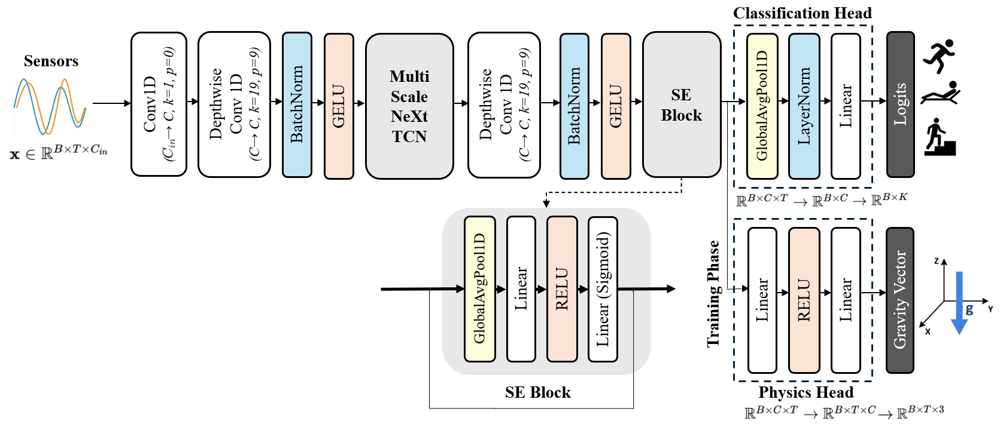

# Learning Physically Consistent Representations for Human Activity Recognition via Modern Temporal Convolutional Network

<p align="center"></p>

This repository implements the methodology proposed in the paper "Learning Physically Consistent Representations for Human Activity
Recognition via Modern Temporal Convolutional Network".


## Paper Overview
**Abstract**: Human activity recognition (HAR) based on wearable inertial measurement units (IMUs) has advanced markedly
with deep learning. However, learning robust representations
for real-world deployment remains challenging, as most models
do not explicitly incorporate the physical structure of IMU
dynamics, relying instead on superficial data statistics. This
lack of physical inductive bias makes them brittle against
sensor noise and orientation distortions, and often necessitates computationally expensive architectures to compensate,
conflicting with the strict constraints of wearable devices. To
address these challenges, we propose a physics-guided multiscale Modern Temporal Convolutional Network (TCN) that
explicitly steers feature learning toward physically plausible
motion dynamics. The backbone extends the Modern TCN
architecture with multi-scale depthwise-separable convolutions
and a large-kernel temporal context module to capture both
short-term transitions and long-range dependencies within a
unified framework. Complementing this backbone, a physicsguided auxiliary branch imposes loss terms derived from static
gravity alignment, complementary filtering, and rigid-body kinematic relationships, thereby penalizing latent representations
that violate fundamental kinematic constraints. This physicsguided regularization suppresses sensor artifacts without explicit denoising and encourages the network to encode intrinsic
motion patterns. Experiments on four public datasets—UCIHAR, WISDM, PAMAP2, and MHEALTH—demonstrate that
the proposed framework achieves state-of-the-art performance
on multiple benchmarks, while maintaining low computational
cost and millisecond-level inference time. These results highlight
that enforcing physical consistency is an effective strategy to
enhance generalization and representation quality in wearablesensor-based human activity recognition.

## Dataset
- **UCI-HAR** dataset is available at _https://archive.ics.uci.edu/dataset/240/human+activity+recognition+using+smartphones_
- **PAMAP2** dataset is available at _https://archive.ics.uci.edu/dataset/231/pamap2+physical+activity+monitoring_
- **MHEALTH** dataset is available at _https://archive.ics.uci.edu/dataset/319/mhealth+dataset_
- **WISDM** dataset is available at _https://www.cis.fordham.edu/wisdm/dataset.php_

## Requirements
```
torch==2.6.0+cu126
numpy==2.3.4
pandas==2.3.3
scikit-learn==1.7.2
matplotlib==3.9.2
seaborn==0.13.2
fvcore==0.1.5.post20221221
```
To install all required packages:
```
pip install -r requirements.txt
```

## Codebase Overview
- `model.py` - Implementation of the proposed PhysReg-TCN architecture with prototype-guided contrastive head.
The implementation uses PyTorch, Numpy, pandas, scikit-learn, matplotlib, seaborn, and fvcore (for FLOPs analysis).

## Citing this Repository

If you use this code in your research, please cite:

```
@article{Learning Physically Consistent Representations for Human Activity
Recognition via Modern Temporal Convolutional Network,
  title = {Learning Physically Consistent Representations for Human Activity
Recognition via Modern Temporal Convolutional Network},
  author={JunYoung Park and Myung-Kyu Yi}
  journal={},
  volume={},
  Issue={},
  pages={},
  year={}
  publisher={}
}
```

## Contact

For questions or issues, please contact:
- JunYoung Park : park91802@gmail.com

## License

This project is licensed under the MIT License - see the [LICENSE](LICENSE) file for details.
